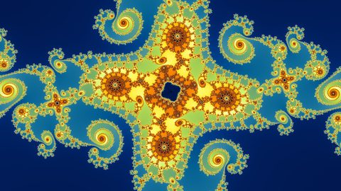

# fractal-wallpapers

This is the pipeline behind a collection of fractal wallpapers. It searches the escape-time
planes for places worth framing, colors and judges each picture, and chooses every gallery.
Rust draws every pixel, and Python does the rest. Most visitors want one of the links below.

- **Wallpapers to download:** [Wallpaper packs](https://techmatt.github.io/fractal-website/wallpaper-packs/)
- **Exploring for yourself:** [The fractal explorer](https://techmatt.github.io/fractal-website/explorer/)
- **How it was made:** [The article, starting here](https://techmatt.github.io/fractal-website/start-here.html)
- **The site's code** (explorer, article, builder): [fractal-website](https://github.com/techmatt/fractal-website)
- **The pipeline and engine code:** you are here; read on.

[](https://github.com/techmatt/fractal-wallpapers/actions/workflows/ci.yml?query=branch%3Amain)

<p align="center">
  
  
  
  
</p>

## What it does

The search space is five families (`mandelbrot`, `multibrot` at degree 3–5, `julia` at
degree 2–5, `phoenix`, and a render-only fractional multibrot), 20 coloring modes and
1,021 colormaps.

Four trained heads pick from that space. Each was trained on human verdicts tracked in
this repository.

| head | what it scores |
| --- | --- |
| `location` | whether a place is worth rendering at all |
| `render` | whether a particular rendering of a place is good |
| `palette` | which colormap and palette pass suit it |
| `gallery_grade` | a finer order inside the render head's top band |

The output is a gallery of a few hundred to a thousand wallpapers, chosen for quality and
for spread across family, color and structure.

## Requirements

* **Python 3.11+.**
* **Rust 1.85+**, from [rustup](https://rustup.rs). The crate is edition 2024 and names
  that floor in `engine/Cargo.toml`.
* **On Windows, the `Desktop development with C++` workload** of
  [Visual Studio Build Tools](https://visualstudio.microsoft.com/visual-cpp-build-tools/),
  which the default `x86_64-pc-windows-msvc` toolchain links through.
* **A GPU only to train.** Rendering, the search walk and gallery selection do not use one.

## Install

```
git clone https://github.com/techmatt/fractal-wallpapers
cd fractal-wallpapers
python -m venv .venv
.venv/Scripts/pip install -e .                   # Linux/macOS: .venv/bin/pip
cargo build --release --manifest-path engine/Cargo.toml
```

Build the engine in release. A debug build is found and used, but runs about ten times
slower, and the walk tests skip themselves when no release binary exists.

The base install has one dependency, `mpmath`, and covers rendering, the search walk, the
supply engine and the labeling rig. Three extras add the rest:

| extra | for |
| --- | --- |
| `models` | training and running the heads (torch, torchvision, timm) |
| `solve` | choosing a gallery (numpy, pillow) |
| `dev` | the test suite and the linter |

A command that crosses one of those lines names the extra it needs instead of raising a
bare `ModuleNotFoundError`.

⚠ **pip installs CPU-only torch, and naming the CUDA index by hand does not fix it.**
`pyproject.toml` routes torch and torchvision to that index through `[tool.uv.sources]`,
and only `uv` reads those keys. `--extra-index-url` is not the equivalent: pip pools both
indices and takes the highest version across the pool, and the CUDA index tops out at
`torch 2.6.0+cu124` where PyPI is further ahead — so the pooled resolve picks PyPI's newer
CPU build, `torch.cuda.is_available()` comes back `False`, and nothing reports an error.
That index trails PyPI's cadence by construction, so an open range recurs on every torch
release. Use `uv`:

```
uv sync --extra dev --extra models --extra solve
```

All three named, because `uv sync` installs exactly what it is told. It writes a `uv.lock`
in the checkout; no lockfile is tracked here.

Failing that, pip needs the exact versions that index holds rather than an open range:

```
.venv/Scripts/pip install --extra-index-url https://download.pytorch.org/whl/cu124 \
  -e ".[dev,models,solve]" torch==2.6.0+cu124 torchvision==0.21.0+cu124
```

**This is a training concern and nothing else.** Rendering, the search walk and choosing a
gallery all run on CPU torch — the judge reads a candidate in about 26 ms there, measured
in [`curation/MEASUREMENTS.md`](src/fractal_wallpapers/curation/MEASUREMENTS.md)'s *The
judge is two orders cheaper than the engine*. A machine that will not train a head wants
the CPU build.

## Quickstart

Render one location. This needs no weights, no GPU and no network.

```
.venv/Scripts/fractal-wallpapers render --family mandelbrot \
  --center-re -0.7436438870371587 --center-im 0.13182590420531197 --width 0.00001 \
  --out artifacts/first.png
```

That writes a 1920x1080 PNG and prints the seconds it spent painting and resampling.

Then redraw a wallpaper from a recorded gallery:

```
.venv/Scripts/fractal-wallpapers curate solve recipes --write --stamp <stamp>
.venv/Scripts/fractal-wallpapers render \
  --recipe artifacts/curation/tentative/<stamp>/recipes.jsonl \
  --key <seat> --out artifacts/seat.jpg
```

`recipes.jsonl` carries the full recipe of each of that record's seats: family, viewport,
iteration cap, mode, curve, colormap, palette pass and levelling band. A redraw is
byte-identical to the picture the record seated. `gallery.jsonl` beside it says which key
is which seat, and `curate solve list` says which records this machine holds.

⚠ **No record is published as of 2026-09-21**, so a fresh clone brings none of this: the
twenty `final139_*` galleries are kept on the machine that made them and read by naming
their stamps. Until a record is published again, the first command above is what makes
the recipe file, out of the candidate ledger.

`--location` is the narrower form. It takes a place and a geometry only, and refuses a row
that says more rather than drawing the right coordinates in the wrong colors.

That key is the first of the four images at the top of this file. Two more are seats,
`0275fee1` and `5ff0ad6b`, drawn the same way and scaled down; the third is an explorer
link, which `examples/README.md` carries.

## Weights

```
.venv/Scripts/fractal-wallpapers fetch-weights
.venv/Scripts/fractal-wallpapers fetch-weights --check    # offline: what is here, and does it hash
```

All four heads come from one GitHub release, and each is verified against the sha256 in
`models/weights.json` before it is kept. A missing asset does not stop the others; the
exit code says whether every head arrived.

**All four assets are MIT**, the same terms as this repository — each row of
`models/weights.json` says so, because a release asset travels without the `LICENSE`
file beside it.

Release tags are dated (`weights-2026-09-14`) and are never moved. A retrained head cuts a
new dated tag and repoints every row in `models/weights.json`, rather than replacing an
asset under a tag a clone has already trusted — the one substitution a hash check cannot
catch. On a machine that already holds the files `--check` never asks GitHub, so to
download and hash every asset from scratch instead:

```
.venv/Scripts/fractal-wallpapers fetch-weights --verify-release
```

**One weight is third party.** `curate embed` reads a frozen DINOv2 ViT-S/14 encoder
([`timm/vit_small_patch14_dinov2.lvd142m`](https://huggingface.co/timm/vit_small_patch14_dinov2.lvd142m),
Apache-2.0), fetched from Hugging Face on first use, pinned to a hub revision in
`src/fractal_wallpapers/models/embedding.py`, and cached in `~/.cache/huggingface`. It is
not re-hosted here, and it is the only command that needs the network after install.

## Workflows

Everything runnable is a subcommand of `fractal-wallpapers`. There are 33 top-level
commands and around 160 counting subgroups, each with its own `--help`. Five workflows use
most of them.

**They are not five independent recipes.** A fresh clone holds tracked labels and nothing
rendered, so *Choose a gallery* has nothing to choose from until *Find new places* and
*Find better renderings* have both run. Three of the five, in this order:

```
fractal-wallpapers fetch-weights
fractal-wallpapers harvest --partition mandelbrot --minutes 60 --no-scoring
fractal-wallpapers curate score --harvest artifacts/harvest
fractal-wallpapers curate embed
fractal-wallpapers curate hunt run --name h1 --budget 1200 --unconditional 600
fractal-wallpapers curate hunt merge --name h1
fractal-wallpapers curate headroom
fractal-wallpapers curate solve run --n 150
```

`--no-scoring` on the first walk because a judged crawl checks the cap its tiles were built
at, and a fresh machine has no tile records to check against; `curate score --harvest` then
reads the same ledger through the head afterwards, which is the pattern
[discovery](src/fractal_wallpapers/discovery/README.md) documents for `reframe` too.
`curate embed` is a hard gate rather than an optional step: a hunt refuses outright against
an empty embedding store.

**The hunt is the only step above that makes pictures.** `curate candidate-ledger backfill`
reads the two decision stores and drives no engine, so on a machine that has rendered
nothing it writes rows with no picture — which a solve cannot seat, the diversity rule
being read off pixels. It is how an existing pool is rebuilt, not a step toward a first
gallery.

**Merging a leg rewrites tracked manifests, and that is expected.** `curate hunt merge` and
`candidate-ledger backfill` both update the manifests under `data/curation/`, and
`rows.manifest.json` can *shrink* as stale history consolidates during a prune. A `git
status` that comes back dirty after a leg is the record keeping up, not an edit you made by
accident.

**Find new places.** A walk over parameter space, scored by the location head, with what
survives folded into the candidate ledger. See
[discovery](src/fractal_wallpapers/discovery/README.md) and
[supply](src/fractal_wallpapers/supply/README.md).

```
fractal-wallpapers census                              # what each partition is owed
fractal-wallpapers harvest --finish-by 07:00           # the production loop
fractal-wallpapers reframe --minutes 20 --out-dir artifacts/reframe_g1
fractal-wallpapers curate score --harvest artifacts/reframe_g1
fractal-wallpapers curate embed                        # a vector per admitted location
```

**Collect human labels**, which is what every head here is trained on. See
[the labeling rig](src/fractal_wallpapers/labeling/README.md).

```
fractal-wallpapers label register --batch NAME --method "how the population was drawn"
fractal-wallpapers label build --from-plan artifacts/places.jsonl --batch NAME
fractal-wallpapers label serve --sheet artifacts/sheet
fractal-wallpapers label ingest --sheet artifacts/sheet --labeler NAME --write
```

**Find better renderings of places already found**, meaning the same location at other
modes, palettes and depths. Three legs, all shaped plan, run, merge. See
[the legs](src/fractal_wallpapers/curation/LEGS.md).

```
fractal-wallpapers curate hunt  run --name h1 --budget 1200 --unconditional 600
fractal-wallpapers curate mine  run --name m1 --rate <measured> --budget 7200
fractal-wallpapers curate depth run --name d1 --rate 0.35 --budget 5400
fractal-wallpapers curate <leg> merge --name <name>
fractal-wallpapers curate candidate-ledger census
```

**Train a head** against a bar written down before the candidate exists. See
[models](src/fractal_wallpapers/models/README.md).

```
fractal-wallpapers tiles build                         # or `renders build`, per head
fractal-wallpapers head preregister                    # the bar, first
fractal-wallpapers head train --run seed0_all_regimes --seed 0
fractal-wallpapers head score --run seed0_all_regimes
fractal-wallpapers head accept                         # the band, against the bar
fractal-wallpapers head ship
```

**Choose a gallery** out of everything the ledger holds, and record it under a stamp that
never moves. See [the gallery pass](src/fractal_wallpapers/curation/GALLERY.md).

```
fractal-wallpapers curate headroom                     # what is short, and what one more costs
fractal-wallpapers curate solve run --n 150            # decide, then render the seats
fractal-wallpapers curate solve record                 # that solve, recorded
fractal-wallpapers curate solve browse --viewer        # the page, off the rows
fractal-wallpapers curate solve viewers <stamp> …      # a page per planned gallery
fractal-wallpapers curate pins resolve                 # pins.txt -> rows every solve seats first
```

## Configuration

Regenerable output lands under `artifacts/`: tile caches, location views, render caches,
and the pictures a study looked at. It reaches a hundred gigabytes or so in normal use.
Records, labels, weights and code stay in the checkout. An untracked `local.toml` at the
repository root moves the output tree, in two tiers:

```toml
hot_root = "D:/fractal-wallpapers/artifacts"       # omit for artifacts/ in the checkout
archive_root = "E:/fractal-wallpapers/artifacts"   # omit if this machine has one disk
```

Writes always land hot. Reads resolve hot first and fall through to the archive.
`FRACTAL_WALLPAPERS_HOT_ROOT` and `FRACTAL_WALLPAPERS_ARCHIVE_ROOT` override the file for
one invocation; setting either to the empty string asserts that this machine has no such
root, whatever the file says.

```
fractal-wallpapers storage status              # every subtree, its tier, its size
fractal-wallpapers storage archive tiles       # hot -> archive
fractal-wallpapers storage restore tiles       # archive -> hot
```

Keep the hot tier on an SSD. Three refusals are worth knowing before they happen:

* A configured root that is not present stops the command. It does not fall back to the
  checkout, where an empty tree would read as a cache nobody had built yet.
* One top-level name present in both tiers is refused by name rather than resolved by
  preference.
* `head train`, `renders train` and `palette train` refuse to run when their cache
  resolves through the archive tier, and name the restore command. Output paths inside an
  archived subtree are refused for the same reason.

Records name files under the tree as `artifacts/...` whichever root and tier they are
really on, and resolve back on read.

### Continuing on another machine

Most of what the pipeline reads is untracked; `storage export` carries it (3.91 GiB in
750 files on 2026-09-22, no pictures) and the new machine re-renders before any solve:

```
fractal-wallpapers storage export --to <archive disk>/portable/<stamp>
fractal-wallpapers storage import --from <part 1> --from <part 2> --root <hot_root>
fractal-wallpapers curate candidate-ledger re-render --keys <gallery.jsonl>   # one known solve, minutes
fractal-wallpapers curate candidate-ledger re-render --seatable               # days
fractal-wallpapers curate candidate-ledger re-render --rest                   # whenever
fractal-wallpapers curate mine package --name <leg> --out <dir>               # there; then here:
fractal-wallpapers curate mine unpack --from <dir>
fractal-wallpapers curate mine merge --name <leg>
```

* **One disk:** `local.toml` names the hot root alone, `hot_root = "C:/fractal-storage"`.
* **Build:** `rustup show`; if the host is not MSVC, `cargo +stable-x86_64-pc-windows-msvc build --release --manifest-path engine/Cargo.toml`.
* **Torch:** the `models` extra's index is CUDA-only, and without an NVIDIA GPU it still installs a CPU torch that does everything but training.
* **Paths:** Git Bash's `/c/...` is not a path to `python.exe`; write `C:/...`.

[The package README](src/fractal_wallpapers/README.md)'s *Continuing on a fresh box* has
the rest.

## How it works

The Rust crate in `engine/` renders every pixel, and Python reaches it only through
`src/fractal_wallpapers/engine.py`. The crate carries no `cfg(target_arch)`, so it also
compiles to `wasm32-unknown-unknown` unmodified and draws identical bytes there.

Records are JSONL and have carried an integer `schema` field since their first row. A
label row carries the label and the complete render parameters together, so a labeled
example is never split across two files. Every random draw is seeded, and the seed is
recorded with the result.

## Documentation

Every directory explains itself, next to the code it explains. There is no `docs/` tree.

| where | what |
| --- | --- |
| [`engine/`](engine/README.md) | the Rust renderer: the spec it reads, the families, the coloring modes |
| [`src/fractal_wallpapers/`](src/fractal_wallpapers/README.md) | the Python side, one README per package |
| [`src/fractal_wallpapers/curation/`](src/fractal_wallpapers/curation/README.md) | the candidate ledger, the legs, the gallery pass |
| [`data/`](data/README.md) | the tracked records, one README per store |
| [`models/`](models/README.md) | the trained heads, one README per head |
| [`tests/`](tests/README.md) | what the suite guards, and why each guard exists |

## Checks

```
python -m ruff check . && python -m ruff format --check .
python -m pytest
cargo test --manifest-path engine/Cargo.toml
```

`python -m pytest` runs the fast lane and prints how many tests it held back.
`python -m pytest --slow` runs everything, which is what CI runs.

## License

MIT. See [`LICENSE`](LICENSE).

The DINOv2 encoder described under [Weights](#weights) is third-party, Apache-2.0, and is
fetched from Hugging Face rather than redistributed here.
