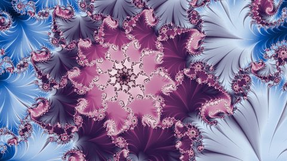
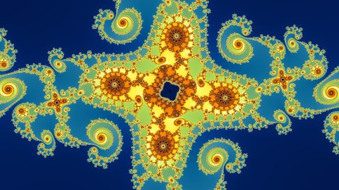

# fractal-wallpapers

This is the pipeline for generating a collection of fractal wallpapers and manipulating them in an online fractal explorer. It searches the escape-time planes for places worth framing, uses a trained convolutional network to judge each picture, and chooses the final galleries from among the high-scoring wallpapers. Rust does the rendering (using WebAssembly for the website), and Python does a lot of the plumbing. Most visitors want one of the links below.
- **Wallpapers to download:** [Wallpaper packs](https://techmatt.github.io/fractals/wallpaper-packs/)
- **Exploring for yourself:** [The fractal explorer](https://techmatt.github.io/fractals/explorer/)
- **How it was made:** [The article, starting here](https://techmatt.github.io/fractals/start-here.html)
- **The site's code** (explorer, article, builder): [fractals](https://github.com/techmatt/fractals)
- **The pipeline and engine code:** you are here; read on.

[](https://github.com/techmatt/fractal-wallpapers/actions/workflows/ci.yml?query=branch%3Amain)

<p align="center">
  <a href="https://techmatt.github.io/fractals/explorer/index.html?v=4&m=stripe&x=-1.2514947263705116&y=0.04110851135180772&w=0.0000000798119929768514&p=cmr.jungle&mirror=1"></a>
  <a href="https://techmatt.github.io/fractals/explorer/index.html?v=4&f=phoenix&cx=-0.45709691767279576&cy=-0.199309339142123&px=0.26195066562519664&py=-0.03188285542142037&zx=0.23987361417464126&zy=0.45066347511034605&m=threads&x=1.1154713756796277&y=0.1372761613815802&w=0.0006723781020213695&p=Sapphire%20Against%20Rose"></a>
  <a href="https://techmatt.github.io/fractals/explorer/index.html?v=4&f=julia4&cx=0.44637678855595264&cy=0.6581861161102234&x=-0.0006944498037232774&y=-0.007170259608518661&w=0.644829668143998&p=glowdon&phase=0.053"></a>
  <a href="https://techmatt.github.io/fractals/explorer/index.html?v=4&f=julia3&cx=0.4169190761394084&cy=0.006933824661843332&m=threads&x=-0.054828545370623066&y=0.017335365897850258&w=0.251946210734878&p=Cobalt%20Furnace%20Ultra&phase=0.95781"></a>
</p>

## What it does

The search covers the Mandelbrot set, multibrots of degree 3 to 6, Julia sets of degree 2
to 6, the Phoenix set, and a render-only fractional multibrot, drawn in about twenty
coloring modes through about a thousand palettes.

Four judges pick from that space. Three are trained on human ratings tracked in this
repository; the palette judge is distilled from an older palette model.

| judge | what it scores |
| --- | --- |
| `location` | whether a place is worth rendering at all |
| `render` | whether a particular rendering of a place is good |
| `palette` | which palette suits a place |
| `gallery_grade` | a finer order inside the render judge's top band |

The output is a gallery of a few hundred to a thousand wallpapers, chosen for quality and
for spread across family, color, and structure.

## How this relates to techmatt/fractals

This repository is the pipeline: the Rust engine that draws every pixel, the search, the
coloring, the judges, and the curation that picks the gallery.
[techmatt/fractals](https://github.com/techmatt/fractals) is the site that presents it:
the [article](https://techmatt.github.io/fractals/start-here.html), the
[explorer](https://techmatt.github.io/fractals/explorer/), and the
[wallpaper packs](https://techmatt.github.io/fractals/wallpaper-packs/). The explorer runs
this engine compiled to WebAssembly, and it draws the same bytes there as it does natively.
Every wallpaper carries its explorer link in its metadata, so any of them reopens in the
explorer, and any explorer view can be rendered here at full size.

## What is where

- `engine/`: the Rust renderer, including `render-link`
- `src/fractal_wallpapers/`: the Python side, one package per stage
  - `discovery/` and `supply/`: the search over the complex plane, and how its time is split
  - `deep/`: the same search below the ordinary walk's depth
  - `palettes/` and `coloring/`: the palette library, and the tone a finished render is held to
  - `labeling/`: the rig that collects human ratings
  - `models/`: the judges, and how each is trained and accepted
  - `curation/`: the candidate pool, the legs that fill it, and the gallery solve
  - `cli/`: the `fractal-wallpapers` command, one module per command group
- `data/`: the tracked records: labels, palettes, and the stores the stages read
- `models/`: each judge's tracked metadata; its weights are fetched beside it
- `tests/`: the suite, and what each guard is for
- `examples/`: the four pictures above

Every directory has a README beside the code it explains. There is no `docs/` tree.

## Requirements

* **Python 3.11+.**
* **Rust 1.85+**, from [rustup](https://rustup.rs).
* **A linker for Rust**: on Windows, the `Desktop development with C++` workload of
  [Visual Studio Build Tools](https://visualstudio.microsoft.com/visual-cpp-build-tools/);
  on macOS, the Xcode Command Line Tools (`xcode-select --install`); on Linux, a C
  compiler (`build-essential` or your distribution's equivalent).
* **A GPU only to train.** Rendering, the search, and choosing a gallery don't use one.

Windows x86_64, Linux x86_64, and macOS on Apple silicon are supported, and CI runs the
full suite on all three. Intel Macs can render, search, and choose a gallery, but can't
install the `models` extra, because torch publishes no macOS x86_64 wheel. Background
priority for render workers is a Windows feature; elsewhere, put `nice` in front of a long
run.

## Install

```
git clone https://github.com/techmatt/fractal-wallpapers
cd fractal-wallpapers
python -m venv .venv
.venv/Scripts/pip install -e .                   # Linux/macOS: .venv/bin/pip
cargo build --release --manifest-path engine/Cargo.toml
```

Build the engine in release. A debug build works but runs about ten times slower.

The base install covers rendering, the search, and the labeling rig. Extras add the rest:

| extra | for |
| --- | --- |
| `models` | running and training the judges (torch, torchvision, timm), on CPU torch |
| `cuda` | `models` on CUDA torch, for training on an NVIDIA card |
| `solve` | choosing a gallery (numpy, pillow) |
| `dev` | the test suite and the linter |

A command that needs an extra you don't have says which one. The simplest full install is
[`uv`](https://docs.astral.sh/uv/), which is what CI runs:

```
uv sync --extra dev --extra models --extra solve
```

That writes a `uv.lock` in the checkout; none is tracked.

To train on an NVIDIA GPU, name `cuda` in place of `models`. Use `uv` for that rather than
pip; [`models/README.md`](src/fractal_wallpapers/models/README.md) explains why, and gives
the pip command if you have to.

## Render a picture

An explorer link is enough on its own. Copy one from the explorer (or from any wallpaper's
metadata) and hand it to the engine with a size:

```
engine/target/release/fractal-engine render-link --size 2560x1440 --out seat.png \
  --link "https://techmatt.github.io/fractals/explorer/?v=4&f=julia&cx=-1.2540170796954613&cy=-0.07161459637319667&m=tia&x=-0.336363658629224&y=-0.06271709146615745&w=0.5659066537374874&p=Oxblood%2C%20Cyan%2C%20Cream&phase=0.597858"
```

That needs no Python, no weights, and no network. It writes the picture with the link
embedded, so the file reopens its view when dropped on the explorer. Deep-zoom (`dv=`)
links aren't drawn yet. [`engine/README.md`](engine/README.md) has the rest.

From Python, one location by its coordinates:

```
.venv/Scripts/fractal-wallpapers render --family mandelbrot \
  --center-re -0.7436438870371587 --center-im 0.13182590420531197 --width 0.00001 \
  --out artifacts/first.png
```

## Run the pipeline

Everything runnable is a subcommand of `fractal-wallpapers`, each with its own `--help`.
The judges' weights come from this repository's GitHub releases, and each file is checked
against the sha256 in `models/weights.json`:

```
fractal-wallpapers fetch-weights
```

A fresh clone holds the tracked labels and nothing rendered, so a first gallery takes a
search, a scoring pass, and a rendering leg before the solve has anything to choose from:

```
fractal-wallpapers harvest --partition mandelbrot --minutes 60 --no-scoring
fractal-wallpapers curate score --harvest artifacts/harvest
fractal-wallpapers curate embed
fractal-wallpapers curate hunt run --name h1 --budget 1200 --unconditional 600
fractal-wallpapers curate hunt merge --name h1
fractal-wallpapers curate solve run --n 150
```

`curate embed` fetches one third-party model on first use, a frozen DINOv2 ViT-S/14
([`timm/vit_small_patch14_dinov2.lvd142m`](https://huggingface.co/timm/vit_small_patch14_dinov2.lvd142m),
Apache-2.0), from Hugging Face. It's the only command that needs the network after
install.

Rendered output goes under `artifacts/`, and in real use that reaches a hundred gigabytes
or so. An untracked `local.toml` can move it to another disk; the
[package README](src/fractal_wallpapers/README.md) explains how.

Each stage's README covers the rest:

| stage | read |
| --- | --- |
| finding places | [`discovery/`](src/fractal_wallpapers/discovery/README.md), [`supply/`](src/fractal_wallpapers/supply/README.md) |
| collecting ratings | [`labeling/`](src/fractal_wallpapers/labeling/README.md) |
| training the judges | [`models/`](src/fractal_wallpapers/models/README.md) |
| rendering more of the places already found | [`curation/LEGS.md`](src/fractal_wallpapers/curation/LEGS.md) |
| choosing a gallery | [`curation/GALLERY.md`](src/fractal_wallpapers/curation/GALLERY.md) |

## How it works

The Rust crate in `engine/` renders every pixel, and Python reaches it only through
`src/fractal_wallpapers/engine.py`. The crate has no platform-specific code, so it compiles
to `wasm32-unknown-unknown` unmodified.

Records are JSONL, and every row carries an integer `schema` field. A label row carries the
label and the complete render parameters together, so a labeled example is never split
across two files. Every random draw is seeded, and the seed is recorded with the result.

## License

The code is MIT; see [`LICENSE`](LICENSE). The judges' weights are MIT too. The wallpapers
are [CC BY 4.0](https://creativecommons.org/licenses/by/4.0/): use them for anything, with
credit to Matt Fisher.

The DINOv2 encoder is third party, Apache-2.0, and is fetched from Hugging Face rather than
redistributed here.
